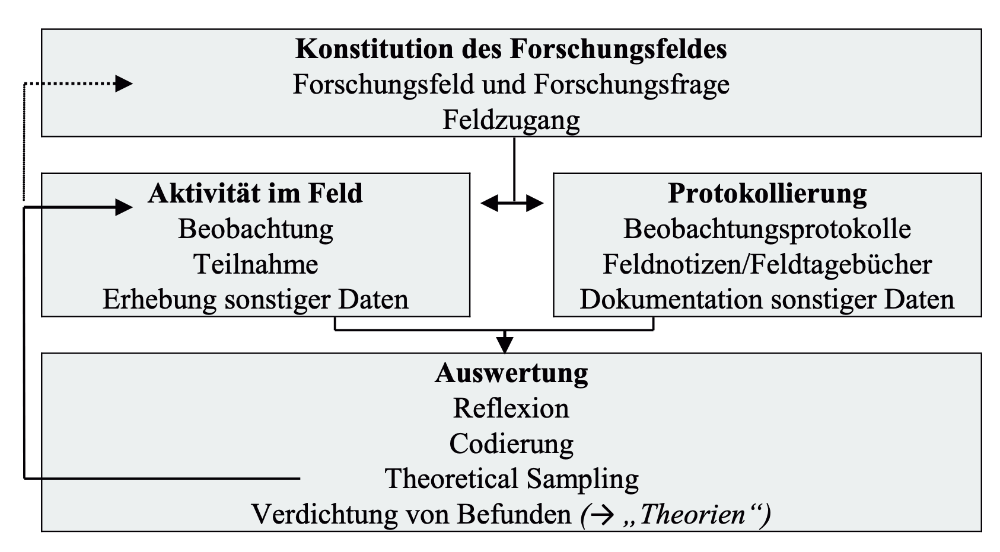
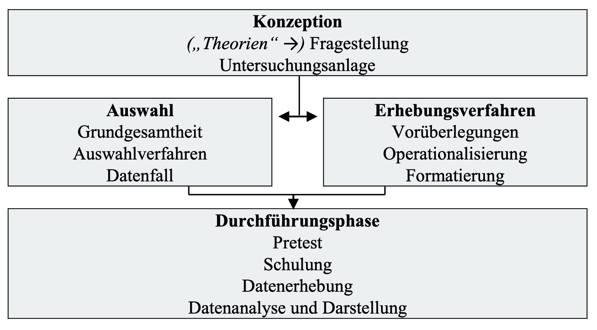
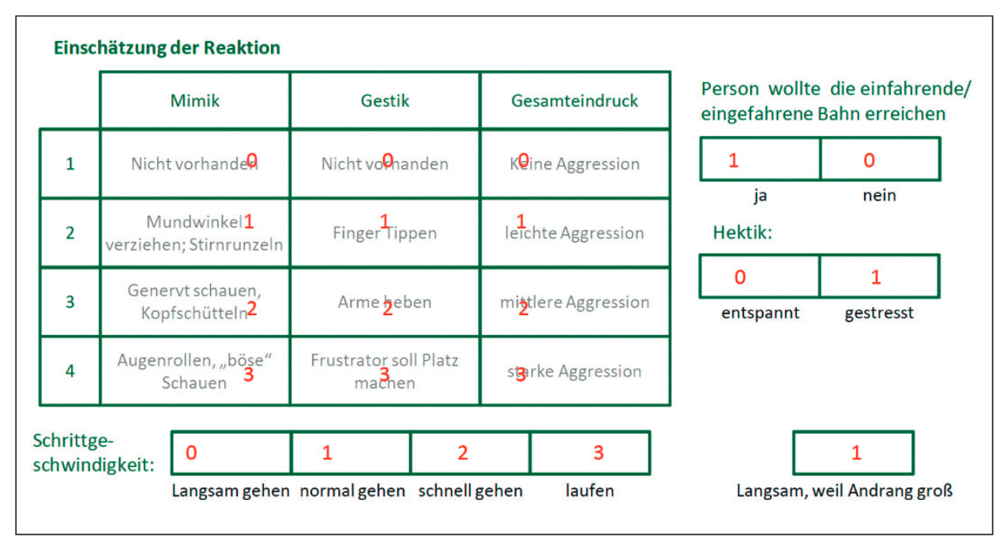

# Beobachtung und Interview
  
Dr. Christof Nägele · Uni Basel & PH FHNW

::: {.source  }
[ADAM](https://adam.unibas.ch/go/crs/2097881). 
[Programm](https://drive.switch.ch/index.php/s/8lu8yRhnX037duE)
:::

# Einstieg Beobachtung und Interview

Beobachten und Fragen stellen gehören zu den alltäglichsten Formen der Informationsgewinnung. Gerade deshalb entsteht leicht der Eindruck, dass Beobachtungen und Interviews unkomplizierte Methoden sind, die schnell zu validen Erkenntnissen führen. Wissenschaftliche Beobachtung und wissenschaftliche Interviews unterscheiden sich jedoch grundlegend von Alltagspraktiken: Sie sind systematisch, theoriegeleitet, transparent und reflektiert.

Der Blockkurs geht der Frage nach, wie Beobachtungen und Interviews so geplant und durchgeführt werden können, dass sie als wissenschaftliche Methoden belastbare Daten liefern – und wann welche Methode für eine gegebene Forschungsfrage geeignet ist.

# Bringen Sie am ersten Termin etwas mit

*Beobachtung* 
Führen Sie aktuell eine Beobachtungsstudie durch oder planen Sie eine Beobachtungsstudie?  
- Falls ja: Was ist die Forschungsfrage und Ihr (geplantes) Vorgehen? 
- Falls nein: Was wäre aus Ihrer Sicht eine spannende Forschungsfrage, die mittels einer Beobachtungsstudie durchgeführt werden könnte?  

*Interview* 
Überlegen Sie sich Fragen und einen Ablauf für ein Interview. Es ist ein Interview zu Lebens- und Karriereverläufen. Die interessierende Zielgruppe sind Studierende an der Uni Basel in einem Studiengang am IBW. Wie waren deren Wege ins Studium? 

# Beobachten ist einfach

<video src="images/Monkey-Business-Illusion.mp4" controls width="800"></video>

::: {.source}
[https://www.youtube.com/watch?v=IGQmdoK_ZfY](https://www.youtube.com/watch?v=IGQmdoK_ZfY)
:::

# Interview führen ist einfach

::: {.small-text}
Interview 1972: Brandt zu Währungspolitik nach Konsultation mit Pompidou.
:::

<video src="images/Friedrich-Nowottny-interviewt-Willy-Brandt-(WDR-1972).mp4" controls width="800"></video>

# Fragen zu stellen ist einfach

::: {.small-text}

Two priests, a Dominican and a Jesuit, are discussing whether it is a sin to smoke and pray at the same time. After failing to reach a conclusion, each goes off to consult his respective superior.   
The next day they meet again.   
The Dominican says, "Well, what did your superior say?" 
The Jesuit responds, "He said it was all right."  
"That's funny, "the Dominican replies. "My superior said it was a sin."  

The Jesuit says, „What did you ask him?“ 
The Dominican replies, „I asked him if it was right to smoke while praying.“ 
„Oh,“ says the Jesuit. „I asked my superior if it was all right to pray while smoking.“
::: 

::: {.source}
Bradburn, N. M., Sudman, S., & Wansink, B. (2004). *Asking questions. The definitive guide to questionnaire design for market research, political polls, and social and health questionnaires, revised edition*. John Wiley & Sons, Inc.
:::

# BEOBACHTUNG

Beobachtung als wissenschaftliche Methode erfordert Entscheidungen über ihren Gegenstand, ihre Strukturierung und ihre Dokumentation. Sie kann offen oder strukturiert, teilnehmend oder nicht-teilnehmend, verdeckt oder offen erfolgen. Entscheidend ist, dass Beobachtungen nicht „einfach stattfinden“, sondern gezielt geplant und systematisch durchgeführt werden.

# Examples

Learning in clinical settings occurs through engagement in everyday activities and interactions. Yet, clinical settings are complex, dynamic environments and data collection methods such as interviews and focus groups, although valuable, alone may not capture the complexities of these settings.

:::{.source}
Noble, C., Ajjawi, R., Billett, S., & Goldszmidt, M. (2025). How to approach qualitative observational research in workplace learning. *The Clinical Teacher, 22*(1), e70005. https://doi.org/10.1111/tct.70005
:::

# Example A 

Health care practitioners learn through experience in clinical environments in which supervision is a key component, but how that learning occurs outside the supervision relationship remains largely unknown.   
This study explores the environmental factors that inform and support workplace learning within a clinical environment.

::: {.source}
Sheehan, D., Jowsey, T., Parwaiz, M., Birch, M., Seaton, P., Shaw, S., Duggan, A., & Wilkinson, T. (2017). Clinical learning environments: Place, artefacts and rhythm. *Medical Education, 51*(10), 1049–1060. https://doi.org/10.1111/medu.13390
:::

# Example B

The merits of informal learning have been widely reported and embraced by medical educators. However, research has yet to describe in detail the extent to which informal intraprofessional or informal interprofessional education is part of graduate medical education (GME), and the nature of those informal education experiences.  
This study seeks to describe: (i) who delivers informal education to residents; (ii) how often they do so; (iii) the content they share; and (iv) the teaching techniques they use.

::: {.source}
Varpio, L., Bidlake, E., Casimiro, L., Hall, P., Kuziemsky, C., Brajtman, S., & Humphrey-Murto, S. (2014). Resident experiences of informal education: How often, from whom, about what and how. *Medical Education, 48*(12), 1220–1234. (25413915). https://doi.org/10.1111/medu.12549
:::

# Beobachtung 

- *Strukturierungsgrad der Beobachtung* 
unstrukturiert - vollstrukturiert 
- *Gegenstand der Beobachtung* 
Selbstbeobachtung - Fremdbeobachtung 
- *Direktheit der Beobachtung* 
direkt - indirekt 
- *Ort der Beobachtung* 
Feld - Online - Offline 
- *Involviertheitsgrad Beobachter:in* 
nicht-teilnehmend - passiv - aktiv 
- *Transparenz der Beobachtung*  
offen - verdeckt 

::: {.source}
Döring, N. (2023). Beobachtung. In N. Döring, *Forschungsmethoden und Evaluation in den Sozial- und Humanwissenschaften* (pp. 323–352).
:::

# Beobachtung

<table class="beobachtung">
  <colgroup>
    <col style="width:20%">
    <col style="width:20%">
    <col style="width:20%">
    <col style="width:20%">
    <col style="width:20%">
  </colgroup>

  <tbody>
    <tr>
      <td class="section">Strukturierung</td>
      <td colspan="2">Keine oder geringe Strukturierung: Theoriegenerierend</td>
      <td colspan="2">Starke Strukturierung: Hypothesen prüfend</td>
    </tr>
    <tr>
      <td class="section">Gegenstand</td>
      <td>Fremdbeobachtung</td>
      <td>Selbstbeobachtung</td>
      <td>Fremdbeobachtung</td>
      <td>Selbstbeobachtung</td>
    </tr>
    <tr>
      <td class="section">Formen</td>
      <td>
        <ul>
          <li>Qualitative Beobachtung mit geringem Komplexitätsgrad</li>
          <li>Ethnografische Feldbeobachtung</li>
        </ul>
      </td>
      <td>
        <ul>
          <li>Autoethnografie</li>
        </ul>
      </td>
      <td>
        <ul>
          <li>Quantitative Beobachtung mit geringem Komplexitätsgrad</li>
          <li>Strukturierte Verhaltensbeobachtung</li>
        </ul>
      </td>
      <td>
        <ul>
          <li>Nonreaktive Beobachtung von Verhaltensspuren</li>
        </ul>
      </td>
    </tr>
  </tbody>
</table>

::: {.source}
Döring, N. (2023). Beobachtung. In N. Döring, *Forschungsmethoden und Evaluation in den Sozial- und Humanwissenschaften* (pp. 323–352).
:::

# Logik theoriegenerierende Beobachtung

# Logik hypothesenprüfende Beobachtung

# Behavioral Observation 

Rules for Quasi-Naturalistic Family Observation Sessions

::: {.small-text}
1. Everyone in the family must be present.
2. No guests.
3. The family is limited to two rooms.
4. The observers will wait only 10 minutes for all to be present in the two rooms.
5. Telephone: No calls out; briefly answer incoming calls.
6. No TV.
7. No talking to observers while they are coding.
8. Do not discuss anything with the observers that relates to your problems or the procedures you are using to deal with them.
:::

::: {.source}
Heyman, R. E., Lorber, M. F., Eddy, J. M., & West, T. V. (2014). Behavioral observation and coding. In H. T. Reis & C. M. Judd (Eds.), *Handbook of research methods in social and personality psychology* (pp. 345–372). Cambridge University Press.
:::

# Dyadic Conflict Discussion Protocol

::: {.small-text}
1. Setup (prior to first interaction):
:::

::: {.very-small-text}
a. Check random number list to determine if the topic from Participant 1 (e.g., woman) or Participant 2 (e.g.,
man) topic is first. 
b. Look at each participant's top areas of conflict (e.g., from Areas of Change Questionnaire). Pick top area of desired change for participant who will initiate first conversation. In case of a tie within a person, use random number sheet to determine order. If both participants pick the same topic, use it for whoever is randomly chosen to go first. Then choose the next-highest topic for the second
participant's discussion.
:::

::: {.small-text}
2. Instructions for conversations are given separately to participants (i.e., they are in
different rooms):
:::

::: {.very-small-text}
a. To the participant who will initiate the discussion, begin with "You wrote that you'd like to see [other
participant's name] change [conflict topic]..." 
b. To the other partner, begin with "Your partner wrote that s/he'd like to see you change [conflict topic]..." 
c. "We'd like you to have a conversation with [name] about that topic for 10 minutes and try to get somewhere with
it. We'd just like to see you discuss this like you typically talk about problems when you are [at home/in your dorm room/etc.]. [pause for questions] OK, we're just about ready. The last thing is to make sure that you know how you will start. Think to yourself about what you would do if you were to bring up [conflict topic] [at home/in your dorm room/etc.]. Do you know how you would start?" [Check to make sure that
she have some way to start]
:::

::: {.small-text}
3. Prior to second interaction:
:::

::: {.very-small-text}
a. To the participant who will initiate the discussion, begin with "You wrote that you would like to see to see [other participant's name] change [conflict topic]..." 
b. To the other partner, begin with "Your partner wrote that he/she would like to see you change [conflict topic]/ c. To both: "We'd like you to have a conversation with [name] about that topic for 10 minutes and try to get somewhere with it. Like last time, we'd just like to see you discuss this like you do at home/in your dorm room/etc.]."
:::

::: {.source}
Heyman, R. E., Lorber, M. F., Eddy, J. M., & West, T. V. (2014). Behavioral observation and coding. In H. T. Reis & C. M. Judd (Eds.), *Handbook of research methods in social and personality psychology* (pp. 345–372). Cambridge University Press.
:::

# Durchsetzung informeller Normen auf Rolltreppen

::: {.small-text}
Im Rahmen eines Forschungspraktikums wurde im Sommersemester 2009 an der LMU München die Durchsetzung sozialer Normen im Alltag untersucht. Als Beispiel und Fokus der Untersuchung diente die in Deutschland auf Rolltreppen geltende Norm „Links gehen, rechts stehen“. Die Studie wurde inklusive ihrer Ergebnisse 2013 publiziert (Wolbring et al. 2013). In einem Feldexperiment mit einem faktoriellen Design (Eifler/Leitgöb, Kapitel 13 in diesem Band) wurden Passanten durch Teilnehmende des Praktikums gezielt am Gehen auf der Rolltreppe gehindert. Ziel war es die Reaktion (Sanktionswahrscheinlichkeit, Sanktionsstärke und Eintrittsdauer bis zur Sanktion) auf die Normverletzung zu beobachten. Gleichzeitig wurden Symbole des sozialen Status (Geschlecht und Kleidungsstil) der normverletzenden Mitarbeiter systematisch variiert, mit dem Ziel, Effekte des sozialen Status auf die Normdurchsetzung ermitteln zu können.
:::

::: {.source}
Thierbach, C., & Petschick, G. (2022). Beobachtung. In N. Baur & J. Blasius (Eds), *Handbuch Methoden der empirischen Sozialforschung* (pp. 1563–1579). Springer Fachmedien. https://doi.org/10.1007/978-3-658-37985-8_109
:::

# Beobachtungsraster

::: {.source}
Thierbach, C., & Petschick, G. (2022). Beobachtung. In N. Baur & J. Blasius (Eds), *Handbuch Methoden der empirischen Sozialforschung* (pp. 1563–1579). Springer Fachmedien. https://doi.org/10.1007/978-3-658-37985-8_109
:::

# Beobachterübereinstimmung

Wenn die Beobachterübereinstimmung („observer agreement“, „inter-observer reliability“) bei allen Kategorien hoch ist, wird dies als Hinweis darauf gedeutet, dass das Beobachtungssystem insgesamt problemlos auf die zu beobachtenden Fälle anwendbar ist und zu messgenauen Daten führt. 
Geringe Beobachterübereinstimmung deutet darauf hin, dass das Beobachtungssystem unklar bzw. messungenau ist und hinsichtlich einzelner Kategorien überarbeitet werden muss und/oder dass mindestens ein Beobachter verzerrte Beurteilungen abgibt.

::: {.source}
Döring, N. (2023). Beobachtung. In N. Döring, *Forschungsmethoden und Evaluation in den Sozial- und Humanwissenschaften* (pp. 323–352).
:::

# INTERVIEW

Ein wissenschaftliches Interview („research interview“/„scientific interview“) ist die zielgerichtete, systematische und regelgeleitete Generierung und Erfassung von verbalen Äusserungen einer Befragungsperson (Einzelbefragung) oder mehrerer Befragungspersonen (Paar-, Gruppenbefragung) zu ausgewählten Aspekten ihres Wissens, Erlebens oder Verhaltens in mündlicher Form.

::: {.source}
Döring, N. (2023). Beobachtung. In N. Döring, *Forschungsmethoden und Evaluation in den Sozial- und Humanwissenschaften* (pp. 323–352).
:::

# Intervieformen

<table class="interviewformen">
  <colgroup>
    <col>
    <col>
    <col>
  </colgroup>
  <thead>
    <tr>
      <th>Interviewform (Grad der Strukturierung)</th>
      <th>Interviewinstrument (Grad der Standardisierung)</th>
      <th>Interviewfragen (Offenheit/Geschlossenheit)</th>
    </tr>
  </thead>
  <tbody>
    <tr>
      <td>Unstrukturiertes Interview = nicht-strukturiertes Interview</td>
      <td>Kein Instrument</td>
      <td>
        
Offene Fragen:

        
<em>Erinnern Sie sich an den Tag, als Sie die Diagnose bekommen haben? Wie ist das damals gewesen, und wie sind die folgenden Tage verlaufen?</em>

      </td>
    </tr>

    <tr>
      <td>Halbstrukturiertes Interview = teilstrukturiertes Interview</td>
      <td>Halbstandardisiertes = teilstandardisiertes Instrument: Interview-Leitfaden</td>
      <td>
        
Offene Fragen:

        
<em>Welche Symptome hatten Sie?</em> 
        <em>Wie haben Ihre Kinder auf die Krankheit reagiert?</em>

      </td>
    </tr>

    <tr>
      <td>Vollstrukturiertes Interview = strukturiertes Interview</td>
      <td>Vollstandardisiertes = standardisiertes Instrument: Interview-Fragebogen</td>
      <td>
        
Geschlossene Fragen/Aussagen mit Antwortvorgaben:

        
<em>Nehmen Sie momentan Medikamente ein?</em> 
        <em>ja/nein</em>

        
<em>Bewerten Sie Ihren aktuellen Gesundheitszustand auf einer Schulnotenskala!</em> 
        <em>1/2/3/4/5/6</em>

      </td>
    </tr>
  </tbody>
</table>

::: {.source}
Döring, N. (2023). Beobachtung. In N. Döring, *Forschungsmethoden und Evaluation in den Sozial- und Humanwissenschaften* (pp. 323–352).
:::

# Arten von Interviews

- *Problemzentriertes Interview* 
Befragte/r kommt frei zu Wort, es ist aber zentriert auf eine bestimmte Problemstellung 
- *Narratives Interview* 
Eingangsfrage bzw. Erzählaufforderung ohne Unterbrechungen, ohne Vorgaben und in grosser Ausführlichkeit antworten 
- *Leitfaden- und Experteninterviews* 
Führung im Interview über einen vorbereiteten Leitfaden 
- *Journalistisches Interview* 
Asymmetrische Kommunikation: Die/der Interviewer/in fragt, der/die Befragte antwortet 
- *Interviews mit Expert:innen* 
Spezielle Auswahl und Status der Befragten 
- *Fokus-Gruppe* 
Gruppendiskussion

# Fehler bei Interviews

::: {.columns}

::: {.column width="50%"}

::: {.small-text}
1. Interviewende
:::

::: {.very-small-text}
- Unzureichende Auswahl (z. B. fehlende soziale/kommunikative Kompetenzen)
- Mangelhafte Schulung
- Fehlende Standardisierung in der Durchführung
- Einflussnahme auf Antworten (Leading, Suggestionen)
- Unzureichende Kontrolle / Supervision
:::

::: {.small-text}
2. Befragungspersonen
:::

::: {.very-small-text}
- Mangelnde Erreichbarkeit (Non-Response)
- Interviewverweigerung / Abbruch des Interviews
- Ablehnung einzelner Fragen (Item-Non-Response)
- Soziale Erwünschtheit
- Erinnerungsfehler / mangelnde Auskunftsfähigkeit
- Strategisches Antwortverhalten / Verzerrungen
:::

:::

::: {.column width="50%"}

::: {.small-text}
3. Instrument und Durchführung
:::

::: {.very-small-text}
- Mangelhafte theoriebasierte Konstruktion des Instruments
- Unklare oder missverständliche Fragen
- Fehlender oder unzureichender Pretest
- Reihenfolgeeffekte / Kontextwirkungen
- Ungeeignete Antwortformate
- Ungünstige Rahmenbedingungen (Zeitdruck, Störungen, Setting)
- Schwaches Arbeitsbündnis (Interview-Rapport)
:::

::: {.small-text}
4. Dokumentation und Auswertung
:::

::: {.very-small-text}
- Unvollständige oder fehlerhafte Dokumentation
- Selektives Mitschreiben / Interpretationen während der Erhebung
- Kodierfehler / Mangelnde Auswertungsstandardisierung
- Fehlende Intercoder-Reliabilität
- Datenverlust / technische Fehler
:::

:::

:::

::: {.source}
Döring, N., & Bortz, J. (2016). Datenerhebung. In N. Döring & J. Bortz, *Forschungsmethoden und Evaluation in den Sozial- und Humanwissenschaften* (pp. 321–577). Springer-Verlag.
:::

# Hinweise

- Gute / offene Fragen stellen
- Aktiv zuhören
- Erzählungen anregen
- Nonverbale Hinweise beachten
- Die richtige Atmosphäre schaffen
- Sensitive Themen sensibel behandeln
- Klarheit und Präzision

# Gute Fragen stellen

<table class="fragen">
  <colgroup>
    <col>
    <col>
  </colgroup>
  <thead>
    <tr>
      <th>Gut</th>
      <th>So nicht</th>
    </tr>
  </thead>
  <tbody>
    <tr>
      <td>textgenerierende Fragen, z.&nbsp;B. «Beschreiben Sie doch mal…»</td>
      <td>
        
geschlossene Fragen: „Waren Sie damit zufrieden oder unzufrieden?"

        
Besser: …

      </td>
    </tr>
    <tr>
      <td>aufrechterhaltende Fragen, z.&nbsp;B. «Fällt Ihnen sonst noch was hierzu ein?»; «Wie ging es weiter?»</td>
      <td>
        
Ja-Nein-Fragen: «Haben Sie die Stelle dann angenommen?»

        
Besser: …

      </td>
    </tr>
    <tr>
      <td>prozessorientierte Fragen: «Wie kam es eigentlich, dass … ?»</td>
      <td>
        
Begründungen abfragen: «Warum haben Sie das gemacht?»

        
Besser: …

      </td>
    </tr>
    <tr>
      <td>
        
offene Fragen: dabei die eigenen Konzepte in der Frage reflektieren!

        
provokative Fragen: wenn überhaupt nur sparsam, gezielt und überlegt einsetzen, erst gegen Ende oder bei stockender Interviewdynamik

      </td>
      <td>
        
suggestive und wertende Fragen, z.&nbsp;B.: «Sie sind ja in der Türkei eher traditionell aufgewachsen?»

        
Besser: …

      </td>
    </tr>
    <tr>
      <td>kurze, verständliche Fragen</td>
      <td>komplizierte Fragen, Fragereihungen</td>
    </tr>
    <tr>
      <td>beantwortbare Fragen!</td>
      <td>
        
Fragen, die die Kenntnis des/der Befragten übersteigen, z.&nbsp;B. «Was hat Ihr Chef darüber gedacht?»

        
Hauptforschungsfrage direkt und abstrakt stellen, z.&nbsp;B.: «Welches Vaterschaftskonzept haben Sie?»

      </td>
    </tr>
    <tr>
      <td>
        
«weiche» Fragen, z.&nbsp;B.: «Erzählen Sie mir doch bitte mal, welche Erfahrungen Sie so mit Einkaufen im Internet bisher gemacht haben.»

        
Weichmacher: doch, mal, so, eigentlich

        
Verben jedoch nicht in Konjunktivform!

      </td>
      <td>
        Fragen in Schriftsprache bzw. «wie aus der Pistole geschossen»
      </td>
    </tr>
    <tr>
      <td>
        Faktenabfragen gehören ans Ende des Interviews
      </td>
      <td>
        zu frühe Faktenfragen ruinieren den selbstläufigen Kommunikationsprozess
      </td>
    </tr>
    <tr>
      <td>
        die Befragten haben soweit wie möglich monologisches Rederecht
      </td>
      <td>
        häufige Unterbrechungen / Dominanz der interviewenden Person
      </td>
    </tr>
  </tbody>
</table>

::: {.source}
Dresing, T., & Pehl, T. (2018). *Praxisbuch Interview, Transkription & Analyse: Anleitungen und Regelsysteme für qualitativ Forschende.* Eigenverlag.
:::

# W-Fragen

Fragen, die mit einem Fragewort beginnen, fördern das Erzählen, das Verstehen von Perspektiven und Einblicke in Erfahrungen.  

Typische Fragewörter:  

*Wer?*  – Wer war daran beteiligt? 
*Was?*  – Was ist passiert? 
*Wann?* – Wann haben Sie das erlebt? 
*Wo?*   – Wo fand das statt? 
*Wie?*  – Wie ist es dazu gekommen? / Wie sind Sie damit umgegangen?  

*Warum?* – nur zurückhaltend einsetzen, da es häufig zu Rechtfertigungen führt;
besser: „Wie kam es dazu?“ oder „Was waren die Gründe aus Ihrer Sicht?“

# Zuhören

::: {.small-text}
- Aufmerksam und unterbrechungsfrei zuhören 
ausreden lassen, Pausen zulassen
- Gespräch signalisierend begleiten 
Blickkontakt, Nicken, kurze verbale Signale wie „hm“, „ja“
- Gezielt nachfragen und vertiefen z. B. „Können Sie das genauer beschreiben?“
- Paraphrasieren und zusammenfassen 
Gesagtes aufnehmen und rückmelden: „Habe ich Sie richtig verstanden, dass…?“
- Empathisch reagieren, ohne zu bewerten 
Verständnis zeigen, aber keine Zustimmung/Beurteilung ausdrücken
- Offen bleiben und eigene Annahmen zurückstellen 
keine vorschnellen Interpretationen
- Pausen aushalten 
nicht vorschnell eingreifen – oft kommen dann wichtige Ergänzungen
:::

# TAG 2

# Übung

*Interview*
Überlegen Sie sich Fragen und einen Ablauf für ein Interview. Es ist ein Interview zu Lebens- und Karriereverläufen. Die interessierende Zielgruppe sind Studierende an der Uni Basel in einem Studiengang am IBW. Wie waren deren Wege ins Studium?

- Entwicklung eines kurzen interviewleitfadens
- Durchführung

*Beobachtung*
Wie führen Studierende des IBW Interviews durch? 

- Entwicklung eins Beobachtungsrasters 
- Durchführung

# Kurzübung: Aktives Zuhören: 

„Im Interview bedeutet aktives Zuhören:
	•	nicht sofort zur nächsten Frage springen
	•	Antworten aufgreifen und vertiefen
	•	Bedeutungen klären statt interpretieren“

Übung in Dreiergruppen

Rollen:
	•	A = Interviewer:in
	•	B = Befragte:r
	•	C = Beobachter:in

*Runde* 1 (4–5 Min) – „ohne aktives Zuhören“

Thema (einfach, alltagsnah):
👉 „Erzählen Sie von einer Situation, in der Sie unsicher waren.“

Interviewer:
	•	stellt Fragen, aber geht nicht auf Antworten ein
	•	keine Nachfragen, kein Paraphrasieren

Beobachter achtet auf:
	•	Brüche im Gespräch
	•	oberflächliche Antworten
	•	wenig Vertiefung

👉 kurze Rückmeldung (1 Min)

*Runde* 2 (4–5 Min) – „mit aktivem Zuhören“

Interviewer nutzt gezielt:
	•	Paraphrasieren
→ „Wenn ich Sie richtig verstehe, …“
	•	Vertiefende Nachfragen
→ „Können Sie das genauer beschreiben?“
	•	Aufgreifen von Begriffen
→ „Sie sagen ‚unsicher‘ – was genau heisst das für Sie?“

Beobachter achtet auf:
	•	längere / differenziertere Antworten
	•	mehr Beispiele / Konkretisierung
	•	Gesprächsfluss

👉 kurze Rückmeldung (1–2 Min)

*Kurze Auswertung im Plenum* (2–3 Min)

Leitfrage:
👉 „Was verändert aktives Zuhören im Interview?“

# Durchführung Interview und Beobachtung

Gemäss Beobachtungsraster und Interviewleitfaden

# Datenaufbereitung & Auswertung

# Beobachtung

# INTERVIEW

# Transkription

<table class="transkription">
  <colgroup>
    <col>
    <col>
  </colgroup>
  <thead>
    <tr>
      <th>Transkriptionszeichen</th>
      <th>Bedeutung</th>
    </tr>
  </thead>
  <tbody>

    <tr>
      <td class="mono">montag kam er ins krankenhaus</td>
      <td>Interviewtext (nur Kleinschreibung!)</td>
    </tr>

    <tr>
      <td class="mono">MONtag kam er ins krankenhaus</td>
      <td>Betonung von Silben durch Großschreibung</td>
    </tr>

    <tr>
      <td class="mono">MONtag kam er (-) ins krankenhaus</td>
      <td>Geschätzte Kurzpause durch (-)</td>
    </tr>

    <tr>
      <td class="mono">MONtag kam er (---) ins krankenhaus</td>
      <td>Geschätzte längere Pause durch (---)</td>
    </tr>

    <tr>
      <td class="mono">MONtag kam er (2.0) ins krankenhaus</td>
      <td>Gemessene Pause mit Längenangabe in Sekunden (eine Dezimalstelle)</td>
    </tr>

    <tr>
      <td class="mono">MONtag kam er (2.0) ins kranken\</td>
      <td>Abbruch eines Wortes oder Satzes durch \</td>
    </tr>

    <tr>
      <td class="mono">MONtag kam er (2.0) in_s kranken\</td>
      <td>Wortverschmelzung durch _</td>
    </tr>

    <tr>
      <td class="mono">MONtag kam er (2.0) in_s krankn\</td>
      <td>Ausgefallene Buchstaben werden ausgelassen</td>
    </tr>

    <tr>
      <td class="mono">MONtag ka:m er (2.0) in_s krankn\</td>
      <td>Dehnung durch :</td>
    </tr>

    <tr>
      <td class="mono">MONtag ka:m er (2.0) in_s krankn\ ((weinen))</td>
      <td>Para- und außersprachliche Handlungen/Ereignisse in ((...))</td>
    </tr>

    <tr>
      <td class="mono">MONtag ka:m er (2.0) in_s ≪ t krankn ≫\ ((weinen))</td>
      <td>Tonhöhe fallend ≪ t ≫ (steigend: ≪ h … ≫)</td>
    </tr>

    <tr>
      <td class="mono">
        I: [Wann] 
        A: [MONtag] ka:m er (2.0) in_s &lt; krank'n &gt;\ ((weinen))
      </td>
      <td>Gleichzeitiges Reden von Interviewer (I) und Befragungsperson (A), markiert durch […]</td>
    </tr>

  </tbody>
</table>

# Transkription

<table class="transkriptvergleich">
  <colgroup>
    <col>
    <col>
  </colgroup>
  <thead>
    <tr>
      <th>Beispiel für ein inhaltlich-semantisches Transkript</th>
      <th>Beispiel für ein GAT-Transkript</th>
    </tr>
  </thead>
  <tbody>
    <tr>
      <td class="mono">
S2: Ein besonders gutes Beispiel,
das waren mal unsere Nachbarn.
(...), dreißig Jahre verheiratet, (...)
das letzte Kind endlich aus dem
Haus, zum Studieren, (...) weggegangen,
ne, nach Berlin.
      </td>

      <td class="mono">
S2: n besonders ↑`Gutes beispiel das warn mal
unsere ↑`NACHbarn.
(- - -)
ähm (- - -)
↑`DREIßig jahre ver`hEiratet, °hh
das letzte kind (.) `Endlich aus_m
´HAUS,
zum stu´DIERN, (-)
´WEGgegangen, =´ne, °h
nach ber´LIN, °h
      </td>
    </tr>
  </tbody>
</table>

::: {.source}
Dresing, T., & Pehl, T. (2018). *Praxisbuch Interview, Transkription & Analyse: Anleitungen und Regelsysteme für qualitativ Forschende.* Eigenverlag.
:::

# Interview 
We found, for instance, that some of the black students we interviewed relied on cold knowledge' sources such as Google for initial information on VET pathways. Joe and Sarah, respondents from the provincial city, stated,  
SJ: How did you know about the course? 
Joe: I literally just looked online... I just typed in like "Fitness Courses', and
the Uni popped up and it said like an NVQ. 
Sarah: I just did a lot of research online.  
Not dissimilar comments were made by respondents in the metropolitan city. Charles com-
mented, 
Charles: But perhaps I was encouraged, maybe not explicitly, to undertake a vocational course, but that kind of meant that particular style of learning was something that was encouraged, particularly in my sort of GCSE years, so Year Ten and Year Eleven, that kind of hands-on learning approach and that actually reflected some of the courses that I took in GCSE
Nathan drew on his aunt who suggested the course he should take.  
Nathan: To be honest, no teachers actually took me and said look, this is what you should do, or this is what I think you should do, or anything like that. It was just, they were just happy that I finished GCSEs, that I was kind of out of their hair.

::: {.source}
Avis, J., Orr, K., & Warmington, P. (2018). Black students in VET: Learner experiences in an english metropolitan and provincial setting. Zenodo. https://zenodo.org/record/1319626
:::

# Interview Strukturierende Inhaltsanalyse

Bei den strukturierenden qualitativen Inhaltsanalysen handelt es sich um deduktive Kategorienanwendungen, bei denen das Kategoriensystem vorab theoriegeleitet entwickelt und dann an den Text herangetragen wird. 

Hier unterscheiden wir zwischen einfachen Kategorienlisten (nominales Skalenniveau) und ordinal geordneten Kategoriensystemen (z.B. viel mittel – wenig). 

Mit beiden können dann komplexere quantitative Analysen durchgeführt werden. 

Zentrales Hilfsmittel stellt hier der Kodierleitfaden dar, der für jede Kategorie eine Definition, typische Textpassagen als Ankerbeispiele und Kodierregeln zur Abgrenzung zwischen den Kategorien enthält (zur Begründung siehe die Ausführungen im nächsten Abschnitt). Der Kodierleitfaden wird zunächst theoriegeleitet entwickelt und in einer Pilotphase am Material weiter ausgebaut und ergänzt. Die Regeln werden in Tabellenform zusammengestellt. 

::: {.source}
Mayring, P., & Fenzl, T. (2019). Qualitative Inhaltsanalyse. In N. Baur & J. Blasius (Eds), *Handbuch Methoden der empirischen Sozialforschung* (pp. 633–648). Springer Fachmedien Wiesbaden. https://doi.org/10.1007/978-3-658-21308-4_42
:::

# Interview Strukturierende Inhaltsanalyse

<table class="kodierleitfaden">
  <thead>
    <tr>
      <th>Kategorie</th>
      <th>Definition</th>
      <th>Ankerbeispiele</th>
      <th>Kodierregeln</th>
    </tr>
  </thead>
  <tbody>
    <tr>
      <td class="kategorie">
        K1: hohes Selbst- vertrauen
      </td>
      <td class="definition">
        Hohe subjektive Gewissheit, mit der Anforderung gut fertig geworden zu sein, d.&nbsp;h. 
        - Klarheit über die Art der Anforderung und deren Bewältigung, 
        - Positives, hoffnungsvolles Gefühl beim Umgang mit der Anforderung, 
        - Überzeugung, die Bewältigung der Anforderung selbst in der Hand gehabt zu haben.
      </td>
      <td class="beispiele">
        „Sicher hat's mal ein Problemchen gegeben, aber das wurde dann halt ausgeräumt, entweder von mir die Einsicht, oder vom Schüler, je nachdem, wer den Fehler gemacht hat. Fehler macht ja ein jeder.“ (17,23)  
        „Ja klar, Probleme gab's natürlich, aber zum Schluss hatten wir ein sehr gutes Verhältnis, hatten wir uns zusammengerauft.“ (27,33)
      </td>
      <td class="regeln">
        Alle drei Aspekte der Definition müssen in Richtung „hoch“ weisen, es soll kein Aspekt auf nur mittleres Selbstvertrauen schliessen lassen. Sonst Kodierung „mittleres S.“
      </td>
    </tr>

    <tr>
      <td class="kategorie">
        K2: mittleres Selbst- vertrauen
      </td>
      <td class="definition">
        Nur teilweise oder schwankende Gewissheit, mit der Anforderung gut fertig geworden zu sein.
      </td>
      <td class="beispiele">
        „Ich hab mich da einigermassen durchlaviert, aber es war oft eine Gratwanderung.“ (3,55)  
        „Mit der Zeit ist es etwas besser geworden, aber ob das an mir oder an den Umständen lag. Weiß ich nicht.“ (77,20)
      </td>
      <td class="regeln">
        Wenn nicht alle drei Definitionsaspekte auf „hoch“ oder „niedrig“ schliessen lassen.
      </td>
    </tr>

    <tr>
      <td class="kategorie">
        K3: niedriges Selbst- vertrauen
      </td>
      <td class="definition">
        Überzeugung, mit der Anforderung schlecht fertig geworden zu sein, d.&nbsp;h. 
        - wenig Klarheit über die Art der Anforderung, 
        - negatives, pessimistisches Gefühl beim Umgang mit der Anforderung, 
        - Überzeugung, den Umgang mit der Anforderung nicht selbst in der Hand gehabt zu haben.
      </td>
      <td class="beispiele">
        „das hat mein Selbstvertrauen getroffen; da hab ich gemeint, ich bin eine Null – oder ein Minus.“ (5, 34)
      </td>
      <td class="regeln">
        Alle drei Aspekte deuten auf niedriges Selbstvertrauen, auch keine Schwankungen erkennbar.
      </td>
    </tr>
  </tbody>
</table>

::: {.source}
Mayring, P., & Fenzl, T. (2019). Qualitative Inhaltsanalyse. In N. Baur & J. Blasius (Eds), *Handbuch Methoden der empirischen Sozialforschung* (pp. 633–648). Springer Fachmedien Wiesbaden. https://doi.org/10.1007/978-3-658-21308-4_42
:::

# Integration: Methode wählen

